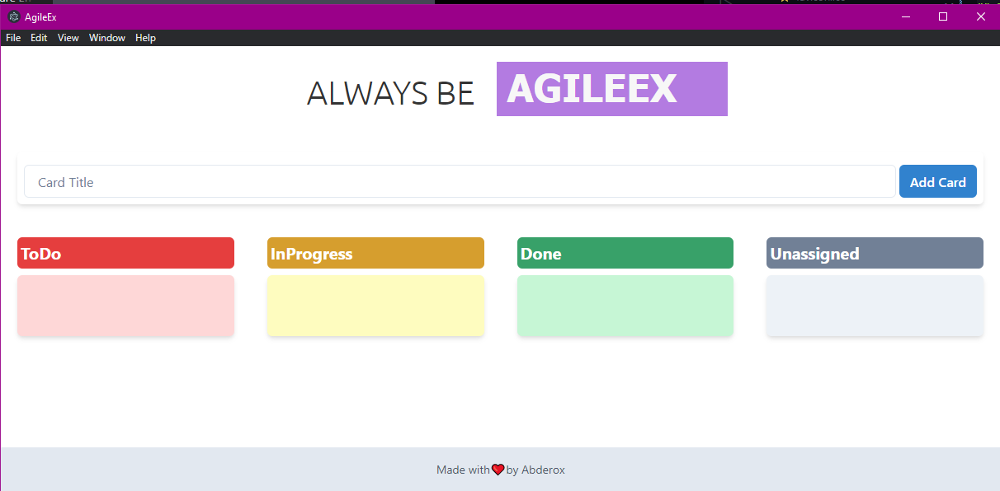
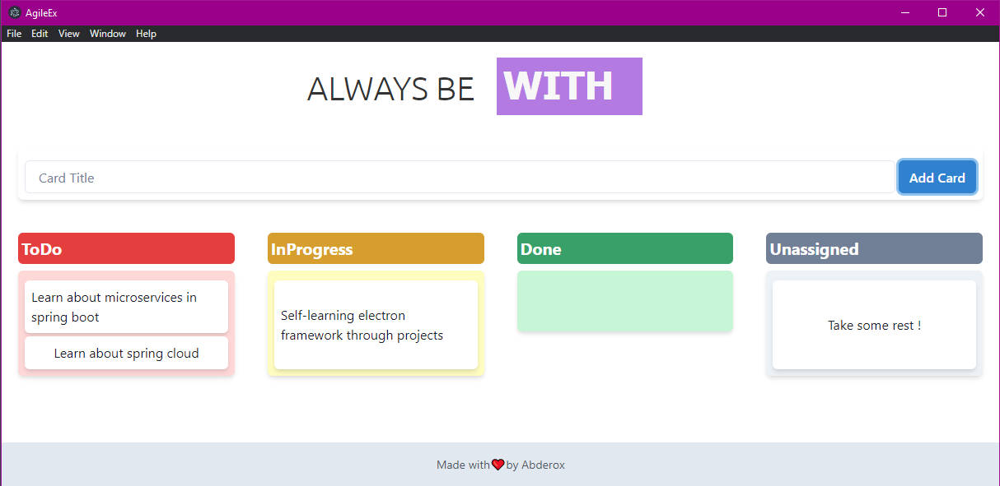

# AgileEx

    

AgileEx is an application built with Electron, React, and DnD-Kit that allows users to create and manage tasks in a Kanban board style. It allows users to easily visualize their workflow and prioritize tasks by dragging and dropping them within the board.

## Features
- Create and manage tasks in a Kanban board style
- Drag and drop tasks to prioritize and visualize workflow
- Built with Electron, React, and DnD-Kit (Credit [LogRocket](https://logrocket.com/))
- Developed with love by Abderox

## Getting Started
1. Clone the repository
2. Run `npm install` to install the dependencies
3. Run `npm run dev` to start the application

## Demo

## Screenshots

    

    

## Contributing
If you are interested in contributing to the project, please contact Abderox or submit a pull request.

## Support
If you encounter any issues or have questions, please contact Abderox for support.

## License
AgileEx is licensed under the MIT License. See [LICENSE](license.txt) for more information.
